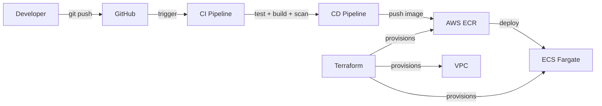

# 🚀 Task Manager — Cloud-Native DevOps Platform

A **production-grade, cloud-native Task Manager** built to demonstrate end-to-end DevOps engineering — from application development through containerization, CI/CD automation, Infrastructure as Code, and cloud deployment.

> **Live Demo:** [http://3.219.216.29:3000](http://3.219.216.29:3000) *(deployed on AWS ECS Fargate)*

---

## 📐 Architecture

```
Developer → GitHub → CI Pipeline (Test → Build → Security Scan)
                         ↓
                    CD Pipeline (Build → Push to AWS ECR)
                         ↓
              Terraform (VPC → ECR → ECS Fargate)
                         ↓
                  Live Application on AWS
```



---

## 🧰 Tech Stack & DevOps Skills Demonstrated

| Category | Technology | What I Did |
|---|---|---|
| **Application** | Node.js, Express | Built a REST API with CRUD operations, health checks, and a Prometheus-compatible metrics endpoint |
| **Containerization** | Docker | Multi-stage Dockerfile, non-root user, health checks, `.dockerignore`, optimized image (~150MB) |
| **CI Pipeline** | GitHub Actions | Automated testing, Docker image builds, and Trivy security scanning on every push |
| **CD Pipeline** | GitHub Actions | Automated Docker image publishing to AWS ECR on version tags |
| **Infrastructure as Code** | Terraform (HCL) | Provisioned VPC, subnets, ECR, ECS cluster, Fargate task definitions, IAM roles, and security groups |
| **Cloud Platform** | AWS | VPC, ECR, ECS Fargate, IAM — all managed via Terraform |
| **Networking** | AWS VPC | Public/private subnets across 2 AZs with Kubernetes-ready subnet tagging |
| **Security** | Helmet.js, Trivy, IAM | CSP headers, vulnerability scanning in CI, least-privilege IAM roles, non-root containers |
| **Monitoring** | Prometheus metrics | Custom `/metrics` endpoint exposing application metrics in Prometheus format |

---

## 📁 Project Structure

```
├── src/
│   ├── app.js               # Express app with REST API + interactive UI
│   └── server.js             # Server entry point
├── tests/
│   └── app.test.js           # Jest + Supertest API tests
├── terraform/
│   ├── providers.tf          # AWS provider + backend config
│   ├── variables.tf          # Input variables
│   ├── vpc.tf                # VPC, subnets, routing
│   ├── ecr.tf                # Container registry + lifecycle policy
│   ├── ecs.tf                # ECS cluster, task definition, service, IAM
│   ├── outputs.tf            # Terraform outputs
│   └── terraform.tfvars      # Variable values
├── .github/workflows/
│   ├── ci.yml                # CI: test → build → security scan
│   └── cd.yml                # CD: build → push to ECR
├── Dockerfile                # Multi-stage production build
├── docker-compose.yml        # Local development
└── package.json
```

---

## 🔄 CI/CD Pipeline

### CI Pipeline (`ci.yml`) — *Runs on every push to `main`*

```
🧪 Run Tests  →  🐳 Build Docker Image  →  🔒 Security Scan (Trivy)
```

- Automated Jest test suite with Supertest
- Docker image build with GitHub Actions cache
- Trivy vulnerability scanner for CRITICAL/HIGH severity issues
- Job dependency chain ensures bad code never gets built

### CD Pipeline (`cd.yml`) — *Runs on version tags (`v*`)*

```
🔐 AWS Login  →  🐳 Build Image  →  📦 Push to ECR
```

- Authenticates to AWS using GitHub Secrets
- Builds and tags Docker image with version + `latest`
- Pushes to Amazon ECR container registry

---

## 🏗️ Infrastructure as Code (Terraform)

All cloud infrastructure is defined as code and version controlled:

| Resource | Purpose |
|---|---|
| **VPC** | Isolated network with public/private subnets across 2 AZs |
| **ECR Repository** | Private Docker image registry with vulnerability scanning and lifecycle policies |
| **ECS Cluster** | Managed container orchestration |
| **Fargate Task** | Serverless container runtime (0.25 vCPU, 512MB) |
| **ECS Service** | Maintains desired task count with network configuration |
| **IAM Roles** | Least-privilege execution role for ECS tasks |
| **Security Group** | Firewall rules allowing only port 3000 inbound |

### Key Terraform Commands
```bash
cd terraform
terraform init      # Initialize providers
terraform plan      # Preview changes
terraform apply     # Deploy infrastructure
terraform destroy   # Tear down (cost control)
```

---

## 🐳 Docker

**Multi-stage build** for production optimization:

- **Stage 1 (Builder):** Installs all dependencies
- **Stage 2 (Production):** Copies only production `node_modules`, runs as non-root user

**Security features:**
- Non-root `appuser` for least-privilege execution
- Built-in health check for container orchestrators
- `.dockerignore` to exclude unnecessary files
- Alpine-based image for minimal attack surface (~150MB)

```bash
# Build and run locally
docker compose up --build

# Verify
curl http://localhost:3000/health
```

---

## 🚀 Getting Started

### Prerequisites
- Node.js 18+, Docker, Terraform, AWS CLI

### Local Development
```bash
npm install
npm run dev          # Start with auto-reload
npm test             # Run test suite
```

### Docker
```bash
docker compose up --build
# Visit http://localhost:3000
```

### Deploy to AWS
```bash
# 1. Provision infrastructure
cd terraform && terraform init && terraform apply

# 2. Push code to trigger CI/CD
git tag v1.0.0 && git push origin v1.0.0

# 3. Force ECS deployment
aws ecs update-service --cluster devops-capstone-cluster \
  --service devops-capstone-service --force-new-deployment
```

---

## 📊 API Endpoints

| Method | Endpoint | Description |
|---|---|---|
| `GET` | `/` | Interactive Task Manager UI |
| `GET` | `/health` | Health check (used by ECS/K8s) |
| `GET` | `/api/tasks` | List all tasks |
| `GET` | `/api/tasks/:id` | Get a single task |
| `POST` | `/api/tasks` | Create a new task |
| `PUT` | `/api/tasks/:id` | Update a task |
| `DELETE` | `/api/tasks/:id` | Delete a task |
| `GET` | `/metrics` | Prometheus-format metrics |

---

## 🔐 Security Practices

- **No hardcoded secrets** — AWS credentials stored as GitHub Secrets
- **Trivy scanning** — Automated vulnerability detection in CI
- **Helmet.js** — HTTP security headers (CSP, HSTS, etc.)
- **Non-root containers** — Least-privilege Docker execution
- **IAM roles** — Scoped permissions for ECS task execution
- **Security groups** — Network-level access control

---

## 📝 License

MIT
