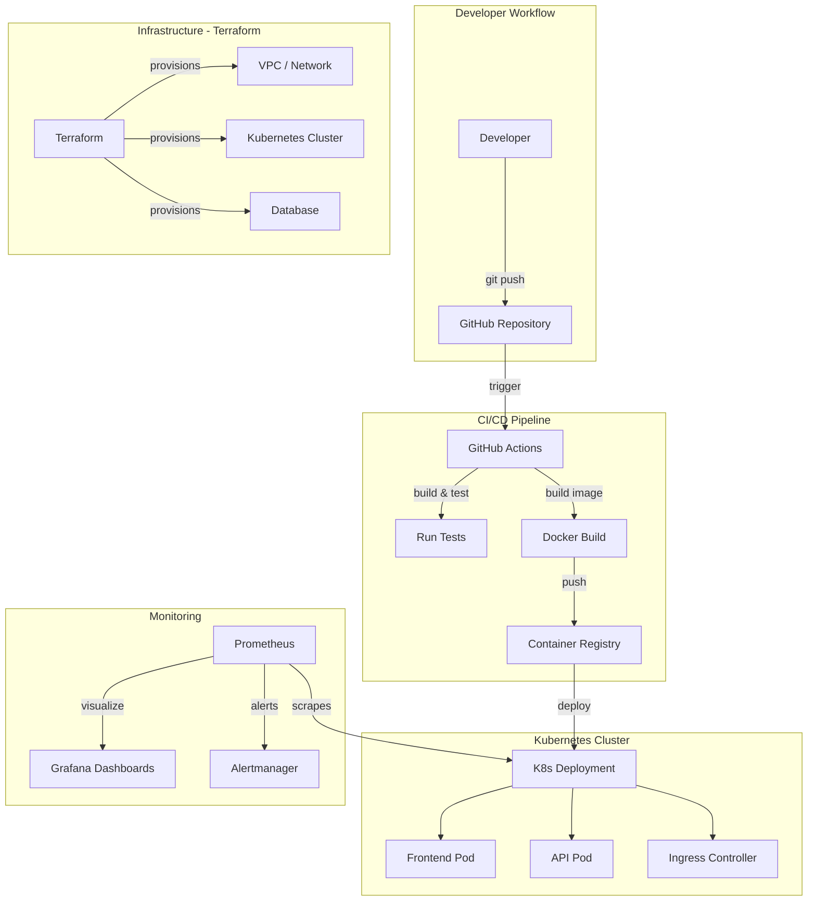

# 🚀 End-to-End Cloud Platform — DevOps Learning Guide

A hands-on, phase-by-phase project that teaches you DevOps by **building a production-grade cloud platform from scratch**. By the end, you'll have a portfolio piece that demonstrates IaC, CI/CD, containers, orchestration, and monitoring.

---

## 📐 Architecture Overview



> [!TIP]
> **You don't need to understand all of this yet!** We'll build it one layer at a time, and by the end each box will make complete sense.

---

## 🧰 Prerequisites & Tools to Install

Before starting, install these tools. Each one will be explained as we use it.

| Tool | What It Does | Install |
|---|---|---|
| **Git** | Version control | [git-scm.com](https://git-scm.com) |
| **Docker Desktop** | Run containers locally | [docker.com](https://www.docker.com/products/docker-desktop/) |
| **Node.js 18+** | Run our sample app | [nodejs.org](https://nodejs.org) |
| **Terraform** | Infrastructure as Code | [terraform.io](https://developer.hashicorp.com/terraform/install) |
| **kubectl** | Control Kubernetes | [kubernetes.io](https://kubernetes.io/docs/tasks/tools/) |
| **Helm** | Kubernetes package manager | [helm.sh](https://helm.sh/docs/intro/install/) |
| **AWS CLI** (or Azure/GCP CLI) | Cloud provider access | [aws.amazon.com/cli](https://aws.amazon.com/cli/) |
| **VS Code** | Code editor | [code.visualstudio.com](https://code.visualstudio.com) |

> [!IMPORTANT]
> **Free Tier Friendly**: This guide uses AWS Free Tier wherever possible. You'll need an AWS account with a credit card on file, but costs should be minimal ($0–$5/month) if you tear down resources after learning.

---

## Phase 1: Build a Simple Application

### 🎓 What You'll Learn
- How web APIs work (REST)
- Basic Node.js/Express patterns
- How to structure a professional project

### 📖 Concept: Why Start With an App?

DevOps doesn't exist in a vacuum — it exists to **ship software reliably**. You need an actual application to deploy. We'll build a simple Task Manager API because it has CRUD operations (Create, Read, Update, Delete), which is realistic enough to exercise the full pipeline.

### Step 1.1 — Initialize the Project

```bash
mkdir devops-capstone && cd devops-capstone
git init
npm init -y
npm install express cors helmet morgan
npm install --save-dev jest supertest nodemon
```

**What each package does:**
- `express` — Web framework (handles HTTP requests)
- `cors` — Allows cross-origin requests (needed when frontend and backend are on different domains)
- `helmet` — Adds security HTTP headers automatically
- `morgan` — Logs every HTTP request (useful for debugging and monitoring later)
- `jest` / `supertest` — Testing framework and HTTP assertion library
- `nodemon` — Auto-restarts your app when code changes (dev convenience)

### Step 1.2 — Create the Application

Create `src/app.js`:

```javascript
const express = require('express');
const cors = require('cors');
const helmet = require('helmet');
const morgan = require('morgan');

const app = express();

// Middleware - these run on EVERY request before your route handlers
app.use(helmet());       // Security headers
app.use(cors());         // Allow cross-origin requests
app.use(morgan('combined')); // Request logging
app.use(express.json()); // Parse JSON request bodies

// In-memory storage (we'll swap this for a real DB later)
let tasks = [];
let nextId = 1;

// Health check endpoint - critical for Kubernetes later!
app.get('/health', (req, res) => {
  res.json({ status: 'healthy', timestamp: new Date().toISOString() });
});

// GET all tasks
app.get('/api/tasks', (req, res) => {
  res.json(tasks);
});

// GET single task
app.get('/api/tasks/:id', (req, res) => {
  const task = tasks.find(t => t.id === parseInt(req.params.id));
  if (!task) return res.status(404).json({ error: 'Task not found' });
  res.json(task);
});

// POST create task
app.post('/api/tasks', (req, res) => {
  const { title, description } = req.body;
  if (!title) return res.status(400).json({ error: 'Title is required' });

  const task = {
    id: nextId++,
    title,
    description: description || '',
    completed: false,
    createdAt: new Date().toISOString()
  };
  tasks.push(task);
  res.status(201).json(task);
});

// PUT update task
app.put('/api/tasks/:id', (req, res) => {
  const task = tasks.find(t => t.id === parseInt(req.params.id));
  if (!task) return res.status(404).json({ error: 'Task not found' });

  const { title, description, completed } = req.body;
  if (title !== undefined) task.title = title;
  if (description !== undefined) task.description = description;
  if (completed !== undefined) task.completed = completed;

  res.json(task);
});

// DELETE task
app.delete('/api/tasks/:id', (req, res) => {
  const index = tasks.findIndex(t => t.id === parseInt(req.params.id));
  if (index === -1) return res.status(404).json({ error: 'Task not found' });

  tasks.splice(index, 1);
  res.status(204).send();
});

// Metrics endpoint - Prometheus will scrape this later!
app.get('/metrics', (req, res) => {
  res.set('Content-Type', 'text/plain');
  res.send(`
# HELP http_requests_total Total HTTP requests
# TYPE http_requests_total counter
http_requests_total{method="GET",path="/api/tasks"} 0
# HELP app_uptime_seconds Application uptime
# TYPE app_uptime_seconds gauge
app_uptime_seconds ${process.uptime()}
  `.trim());
});

module.exports = app;
```

Create `src/server.js`:

```javascript
const app = require('./app');
const PORT = process.env.PORT || 3000;

app.listen(PORT, () => {
  console.log(`🚀 Server running on port ${PORT}`);
  console.log(`📋 Health check: http://localhost:${PORT}/health`);
});
```

> [!NOTE]
> **Why separate `app.js` and `server.js`?** This is a professional pattern. `app.js` defines the application logic (testable without starting a server), and `server.js` starts the server. This separation makes testing much easier — your tests import `app.js` directly without needing to start/stop a real server.

### Step 1.3 — Write Tests

Create `tests/app.test.js`:

```javascript
const request = require('supertest');
const app = require('../src/app');

describe('Task API', () => {
  test('GET /health returns healthy status', async () => {
    const res = await request(app).get('/health');
    expect(res.statusCode).toBe(200);
    expect(res.body.status).toBe('healthy');
  });

  test('POST /api/tasks creates a task', async () => {
    const res = await request(app)
      .post('/api/tasks')
      .send({ title: 'Test task', description: 'A test' });
    expect(res.statusCode).toBe(201);
    expect(res.body.title).toBe('Test task');
    expect(res.body.id).toBeDefined();
  });

  test('GET /api/tasks returns all tasks', async () => {
    const res = await request(app).get('/api/tasks');
    expect(res.statusCode).toBe(200);
    expect(Array.isArray(res.body)).toBe(true);
  });

  test('POST /api/tasks without title returns 400', async () => {
    const res = await request(app)
      .post('/api/tasks')
      .send({ description: 'No title' });
    expect(res.statusCode).toBe(400);
  });
});
```

### Step 1.4 — Update `package.json` Scripts

Add these to the `"scripts"` section:

```json
{
  "scripts": {
    "start": "node src/server.js",
    "dev": "nodemon src/server.js",
    "test": "jest --verbose --forceExit"
  }
}
```

### Step 1.5 — Create `.gitignore`

```
node_modules/
.env
coverage/
*.log
```

### Step 1.6 — Run & Verify

```bash
# Run tests
npm test

# Start the app
npm run dev

# In another terminal, test the API
curl http://localhost:3000/health
curl -X POST http://localhost:3000/api/tasks -H "Content-Type: application/json" -d '{"title":"Learn DevOps"}'
curl http://localhost:3000/api/tasks
```

### ✅ Phase 1 Checkpoint

Before moving on, verify:
- [ ] `npm test` passes all 4 tests
- [ ] `curl /health` returns `{"status":"healthy"}`
- [ ] You can create and retrieve tasks
- [ ] You've committed everything to Git: `git add . && git commit -m "feat: initial task manager API"`

---

## Phase 2: Dockerize the Application

### 🎓 What You'll Learn
- What containers are and why they matter
- How to write a Dockerfile
- Multi-stage builds for production
- Docker Compose for local development

### 📖 Concept: What Is Docker and Why Do We Need It?

**The Problem:** "It works on my machine!" — Every developer has said this. Your app depends on Node.js 18, specific npm packages, and OS-level libraries. When you deploy, the server might have a different Node version, missing packages, or a different OS.

**The Solution:** Docker packages your app + all its dependencies into a **container** — a lightweight, portable, isolated environment. Think of it like a shipping container: no matter what ship (server) carries it, the contents are identical.

```
Without Docker:                    With Docker:
┌─────────────────┐               ┌─────────────────┐
│  Your Laptop    │               │   Container     │
│  Node 18.2      │               │  ┌───────────┐  │
│  npm 9.x        │  ≠ Server    │  │ Node 18   │  │
│  Windows 11     │               │  │ npm 9.x   │  │
│  Your app code  │               │  │ App code  │  │
└─────────────────┘               │  │ All deps  │  │
                                  │  └───────────┘  │
┌─────────────────┐               │  Runs anywhere! │
│  Server         │               └─────────────────┘
│  Node 16.0      │
│  npm 8.x        │
│  Ubuntu 22.04   │
│  💥 broken 💥   │
└─────────────────┘
```

### Step 2.1 — Create the Dockerfile

Create `Dockerfile` in the project root:

```dockerfile
# ============================================
# Stage 1: Install dependencies
# ============================================
# We use a "multi-stage" build. This first stage installs everything,
# but we only copy what we need into the final image.
# This keeps the final image small and secure.
FROM node:18-alpine AS builder

# Set working directory inside the container
WORKDIR /app

# Copy package files first (Docker caches layers — if these files
# haven't changed, Docker skips the npm install step on rebuilds!)
COPY package*.json ./

# Install production dependencies only
RUN npm ci --only=production

# ============================================
# Stage 2: Production image
# ============================================
FROM node:18-alpine

# Security: Don't run as root in production
RUN addgroup -S appgroup && adduser -S appuser -G appgroup

WORKDIR /app

# Copy only the production node_modules from builder stage
COPY --from=builder /app/node_modules ./node_modules

# Copy application source code
COPY src/ ./src/

# Set environment variables
ENV NODE_ENV=production
ENV PORT=3000

# Expose the port (documentation for other developers)
EXPOSE 3000

# Switch to non-root user
USER appuser

# Health check — Docker/K8s will use this to know if the app is alive
HEALTHCHECK --interval=30s --timeout=3s --start-period=5s --retries=3 \
  CMD wget --no-verbose --tries=1 --spider http://localhost:3000/health || exit 1

# Start the application
CMD ["node", "src/server.js"]
```

> [!NOTE]
> **Why multi-stage builds?** The `builder` stage might be 500MB+ with dev dependencies and build tools. The final image only contains what's needed to **run** the app (~150MB). Smaller images = faster deploys, less attack surface, lower storage costs.

### Step 2.2 — Create `.dockerignore`

```
node_modules
npm-debug.log
.git
.gitignore
tests
coverage
README.md
.env
```

> [!TIP]
> `.dockerignore` works like `.gitignore` but for Docker. It prevents unnecessary files from being sent to the Docker build context, speeding up builds.

### Step 2.3 — Create `docker-compose.yml`

```yaml
version: '3.8'

services:
  app:
    build:
      context: .
      dockerfile: Dockerfile
    ports:
      - "3000:3000"        # Map host port 3000 → container port 3000
    environment:
      - NODE_ENV=production
      - PORT=3000
    healthcheck:
      test: ["CMD", "wget", "--spider", "http://localhost:3000/health"]
      interval: 10s
      timeout: 5s
      retries: 3
    restart: unless-stopped  # Auto-restart if the app crashes
```

### Step 2.4 — Build & Run

```bash
# Build the Docker image (tag it with a name)
docker build -t devops-capstone:latest .

# Run it
docker run -p 3000:3000 devops-capstone:latest

# Or use Docker Compose (recommended)
docker compose up --build

# Test it
curl http://localhost:3000/health

# Check image size
docker images devops-capstone
```

### Step 2.5 — Useful Docker Commands to Know

```bash
docker ps                          # List running containers
docker logs <container_id>         # View container logs
docker exec -it <container_id> sh  # Shell into a running container
docker stop <container_id>         # Stop a container
docker system prune                # Clean up unused images/containers
```

### ✅ Phase 2 Checkpoint

- [ ] `docker compose up --build` starts the app successfully
- [ ] `curl http://localhost:3000/health` works while running in Docker
- [ ] Your image size is under 200MB (`docker images devops-capstone`)
- [ ] Commit: `git add . && git commit -m "feat: add Docker support"`

---

## Phase 3: CI/CD Pipeline with GitHub Actions

### 🎓 What You'll Learn
- What CI/CD means and why it matters
- How GitHub Actions works (triggers, jobs, steps)
- Automated testing, linting, and Docker builds
- Container registry publishing

### 📖 Concept: What Is CI/CD?

**CI (Continuous Integration):** Every time you push code, automated checks run (tests, linting, security scans). If anything fails, you know immediately — not after deploying to production at 2 AM on a Friday.

**CD (Continuous Delivery/Deployment):** After CI passes, the code is automatically built into a deployable artifact (Docker image) and optionally deployed to staging/production.

```
Developer pushes code
       │
       ▼
┌──────────────┐    ┌──────────────┐    ┌──────────────┐    ┌──────────────┐
│   Lint Code  │───▶│  Run Tests   │───▶│ Build Docker │───▶│ Push to      │
│              │    │              │    │   Image      │    │ Registry     │
└──────────────┘    └──────────────┘    └──────────────┘    └──────────────┘
     If any step fails, the pipeline STOPS and notifies you ❌
```

### Step 3.1 — Push to GitHub

```bash
# Create a new repo on GitHub, then:
git remote add origin https://github.com/YOUR_USERNAME/devops-capstone.git
git branch -M main
git push -u origin main
```

### Step 3.2 — Create the CI Pipeline

Create `.github/workflows/ci.yml`:

```yaml
name: CI Pipeline

# When does this pipeline run?
on:
  push:
    branches: [main, develop]     # Run on pushes to these branches
  pull_request:
    branches: [main]              # Run on PRs targeting main

# Environment variables available to all jobs
env:
  NODE_VERSION: '18'
  DOCKER_IMAGE: devops-capstone

jobs:
  # ── Job 1: Test ──────────────────────────────────
  test:
    name: 🧪 Run Tests
    runs-on: ubuntu-latest        # GitHub provides free Linux runners

    steps:
      # Check out your code
      - name: Checkout code
        uses: actions/checkout@v4

      # Install Node.js
      - name: Setup Node.js
        uses: actions/setup-node@v4
        with:
          node-version: ${{ env.NODE_VERSION }}
          cache: 'npm'            # Cache node_modules between runs (faster!)

      # Install dependencies
      - name: Install dependencies
        run: npm ci               # 'ci' is faster than 'install' in CI environments

      # Run tests
      - name: Run tests
        run: npm test

  # ── Job 2: Build Docker Image ───────────────────
  build:
    name: 🐳 Build Docker Image
    runs-on: ubuntu-latest
    needs: test                   # Only run AFTER tests pass!

    steps:
      - name: Checkout code
        uses: actions/checkout@v4

      - name: Set up Docker Buildx
        uses: docker/setup-buildx-action@v3

      # Build the image (don't push yet — that's Phase 3.3)
      - name: Build Docker image
        uses: docker/build-push-action@v5
        with:
          context: .
          push: false
          tags: ${{ env.DOCKER_IMAGE }}:${{ github.sha }}
          cache-from: type=gha     # Use GitHub Actions cache
          cache-to: type=gha,mode=max

  # ── Job 3: Security Scan ────────────────────────
  security:
    name: 🔒 Security Scan
    runs-on: ubuntu-latest
    needs: build

    steps:
      - name: Checkout code
        uses: actions/checkout@v4

      - name: Run Trivy vulnerability scanner
        uses: aquasecurity/trivy-action@master
        with:
          scan-type: 'fs'
          scan-ref: '.'
          severity: 'CRITICAL,HIGH'
```

> [!NOTE]
> **`needs: test`** creates a dependency chain. The `build` job won't start until `test` succeeds. This is how you create "gates" — bad code never gets built into an image.

### Step 3.3 — Add Docker Hub Publishing (CD)

Create `.github/workflows/cd.yml`:

```yaml
name: CD Pipeline

on:
  push:
    tags:
      - 'v*'                     # Only run when you push a version tag

env:
  DOCKER_IMAGE: YOUR_DOCKERHUB_USERNAME/devops-capstone

jobs:
  publish:
    name: 📦 Publish Docker Image
    runs-on: ubuntu-latest

    steps:
      - name: Checkout code
        uses: actions/checkout@v4

      - name: Set up Docker Buildx
        uses: docker/setup-buildx-action@v3

      # Login to Docker Hub using secrets (never hardcode passwords!)
      - name: Login to Docker Hub
        uses: docker/login-action@v3
        with:
          username: ${{ secrets.DOCKERHUB_USERNAME }}
          password: ${{ secrets.DOCKERHUB_TOKEN }}

      # Extract version from the git tag
      - name: Extract version
        id: version
        run: echo "VERSION=${GITHUB_REF#refs/tags/v}" >> $GITHUB_OUTPUT

      # Build and push with multiple tags
      - name: Build and push
        uses: docker/build-push-action@v5
        with:
          context: .
          push: true
          tags: |
            ${{ env.DOCKER_IMAGE }}:${{ steps.version.outputs.VERSION }}
            ${{ env.DOCKER_IMAGE }}:latest
          cache-from: type=gha
          cache-to: type=gha,mode=max
```

### Step 3.4 — Configure Secrets

In your GitHub repo, go to **Settings → Secrets and variables → Actions** and add:
- `DOCKERHUB_USERNAME` — Your Docker Hub username
- `DOCKERHUB_TOKEN` — A Docker Hub Access Token (not your password!)

> [!CAUTION]
> **Never commit passwords, API keys, or tokens to Git.** GitHub Secrets are encrypted and only available to your CI/CD pipelines at runtime. If you accidentally commit a secret, rotate it immediately — Git history is permanent.

### Step 3.5 — Test the Pipeline

```bash
# Push to trigger CI
git add . && git commit -m "feat: add CI/CD pipelines"
git push origin main

# Go to GitHub → Actions tab to watch it run!

# To trigger CD (publish), create a version tag:
git tag v1.0.0
git push origin v1.0.0
```

### ✅ Phase 3 Checkpoint

- [ ] Pushing to `main` triggers the CI pipeline
- [ ] All 3 jobs pass: test → build → security
- [ ] Creating a `v*` tag triggers the CD pipeline and publishes to Docker Hub
- [ ] You can pull your image: `docker pull YOUR_USERNAME/devops-capstone:latest`

---

## Phase 4: Infrastructure as Code with Terraform

### 🎓 What You'll Learn
- What IaC is and why clicking in the AWS Console is dangerous
- Terraform syntax (HCL), providers, resources, and state
- Networking fundamentals (VPC, subnets, security groups)
- How to provision real cloud infrastructure

### 📖 Concept: What Is Infrastructure as Code?

**The Problem:** You click through the AWS Console to create a server. It works. Two months later, you need another one exactly the same, but you've forgotten which check boxes you checked. Or, your colleague needs to create the same setup in a different region — instant communication breakdown.

**The Solution:** Define your infrastructure in **code files** that are version controlled, reviewable, and repeatable. Terraform reads these files and creates/updates/deletes cloud resources to match.

```
Traditional:                    Infrastructure as Code:
Human clicks buttons  ────▶    Code defines infrastructure
❓ No record               ────▶    📝 Version controlled
🤷 Not repeatable          ────▶    🔄 Perfectly repeatable
🐛 Prone to mistakes       ────▶    ✅ Peer reviewed
⏰ Slow to recreate        ────▶    ⚡ Instant recreation
```

### Step 4.1 — Set Up Terraform Directory Structure

```
terraform/
├── main.tf              # Main configuration
├── variables.tf         # Input variables
├── outputs.tf           # Output values
├── providers.tf         # Cloud provider config
├── vpc.tf               # Network infrastructure
├── ecr.tf               # Container registry
└── terraform.tfvars     # Variable values (DO NOT commit secrets!)
```

### Step 4.2 — Provider Configuration

Create `terraform/providers.tf`:

```hcl
# This tells Terraform we're working with AWS
terraform {
  required_version = ">= 1.0"

  required_providers {
    aws = {
      source  = "hashicorp/aws"
      version = "~> 5.0"
    }
  }

  # Store Terraform state remotely (so your team can collaborate)
  # Uncomment after creating the S3 bucket manually first
  # backend "s3" {
  #   bucket = "your-terraform-state-bucket"
  #   key    = "devops-capstone/terraform.tfstate"
  #   region = "us-east-1"
  # }
}

provider "aws" {
  region = var.aws_region

  default_tags {
    tags = {
      Project     = "devops-capstone"
      Environment = var.environment
      ManagedBy   = "terraform"
    }
  }
}
```

> [!NOTE]
> **Terraform State:** Terraform tracks what it has created in a "state file." This is how it knows the difference between "create new" and "update existing." For team projects, store state in S3 (remote backend) so everyone shares the same state.

### Step 4.3 — Variables

Create `terraform/variables.tf`:

```hcl
variable "aws_region" {
  description = "AWS region to deploy to"
  type        = string
  default     = "us-east-1"
}

variable "environment" {
  description = "Environment name (dev, staging, prod)"
  type        = string
  default     = "dev"
}

variable "project_name" {
  description = "Project name used for resource naming"
  type        = string
  default     = "devops-capstone"
}
```

### Step 4.4 — VPC (Virtual Private Cloud)

Create `terraform/vpc.tf`:

```hcl
# A VPC is your own private network in the cloud.
# Think of it as your own private data center.
module "vpc" {
  source  = "terraform-aws-modules/vpc/aws"
  version = "~> 5.0"

  name = "${var.project_name}-vpc"
  cidr = "10.0.0.0/16"      # IP range: 10.0.0.0 – 10.0.255.255 (65,536 IPs)

  azs             = ["${var.aws_region}a", "${var.aws_region}b"]
  private_subnets = ["10.0.1.0/24", "10.0.2.0/24"]  # Internal resources (not internet-facing)
  public_subnets  = ["10.0.101.0/24", "10.0.102.0/24"]  # Internet-facing resources

  enable_nat_gateway = true   # Lets private subnet resources access the internet
  single_nat_gateway = true   # Use 1 NAT gateway (cost saving for dev)

  # Tags required for Kubernetes to discover subnets
  public_subnet_tags = {
    "kubernetes.io/role/elb" = 1
  }
  private_subnet_tags = {
    "kubernetes.io/role/internal-elb" = 1
  }
}
```

> [!NOTE]
> **Subnets 101:** Public subnets can talk to the internet directly. Private subnets cannot — they use a NAT Gateway as a controlled exit point. Your app runs in private subnets (secure), but the load balancer sits in public subnets (accessible to users).

### Step 4.5 — ECR (Container Registry)

Create `terraform/ecr.tf`:

```hcl
# ECR is AWS's Docker Hub — a place to store your Docker images
resource "aws_ecr_repository" "app" {
  name                 = var.project_name
  image_tag_mutability = "MUTABLE"

  # Automatically scan images for known vulnerabilities
  image_scanning_configuration {
    scan_on_push = true
  }

  # Clean up old images to save money
  lifecycle {
    prevent_destroy = false
  }
}

# Keep only the last 10 images (delete older ones automatically)
resource "aws_ecr_lifecycle_policy" "app" {
  repository = aws_ecr_repository.app.name

  policy = jsonencode({
    rules = [{
      rulePriority = 1
      description  = "Keep last 10 images"
      selection = {
        tagStatus   = "any"
        countType   = "imageCountMoreThan"
        countNumber = 10
      }
      action = {
        type = "expire"
      }
    }]
  })
}
```

### Step 4.6 — Outputs

Create `terraform/outputs.tf`:

```hcl
output "vpc_id" {
  description = "VPC ID"
  value       = module.vpc.vpc_id
}

output "ecr_repository_url" {
  description = "ECR Repository URL (use this in your Docker push commands)"
  value       = aws_ecr_repository.app.repository_url
}
```

### Step 4.7 — Deploy!

```bash
cd terraform

# Initialize Terraform (downloads provider plugins)
terraform init

# Preview what Terraform will create (ALWAYS do this before apply!)
terraform plan

# Create the infrastructure (type 'yes' to confirm)
terraform apply

# View the outputs
terraform output
```

> [!WARNING]
> **`terraform destroy`** deletes EVERYTHING Terraform created. Use it to clean up and avoid charges, but never run it against production without thinking carefully.

### ✅ Phase 4 Checkpoint

- [ ] `terraform plan` shows the resources to be created
- [ ] `terraform apply` successfully creates VPC + ECR
- [ ] You can see the resources in the AWS Console
- [ ] Commit: `git add terraform/ && git commit -m "feat: add Terraform infrastructure"`

---

## Phase 5: Kubernetes Deployment

### 🎓 What You'll Learn
- What Kubernetes is and its core objects (Pods, Deployments, Services)
- How to write Kubernetes manifests
- Helm charts for templated deployments
- EKS (managed Kubernetes on AWS)

### 📖 Concept: What Is Kubernetes?

Docker runs **one container** on **one machine**. Kubernetes runs **many containers** across **many machines** and handles:
- **Scaling** — Need more capacity? K8s spins up more containers
- **Self-healing** — Container crashes? K8s restarts it automatically
- **Rolling updates** — Deploy new version with zero downtime
- **Service discovery** — Containers find each other by name

```
Kubernetes Cluster
┌─────────────────────────────────────────────┐
│  Node 1 (Server)    Node 2 (Server)         │
│  ┌────────────┐     ┌────────────┐          │
│  │ Pod: app   │     │ Pod: app   │          │
│  │ (container)│     │ (container)│          │
│  └────────────┘     └────────────┘          │
│  ┌────────────┐     ┌────────────┐          │
│  │ Pod: app   │     │ Pod: app   │          │
│  │ (container)│     │ (container)│          │
│  └────────────┘     └────────────┘          │
│                                             │
│  Kubernetes decides which pod runs where!   │
└─────────────────────────────────────────────┘
```

### Step 5.1 — Create Kubernetes Manifests

Create `k8s/namespace.yml`:

```yaml
# Namespaces organize resources (like folders for your cluster)
apiVersion: v1
kind: Namespace
metadata:
  name: devops-capstone
```

Create `k8s/deployment.yml`:

```yaml
apiVersion: apps/v1
kind: Deployment
metadata:
  name: task-api
  namespace: devops-capstone
  labels:
    app: task-api
spec:
  replicas: 3                    # Run 3 copies for high availability
  selector:
    matchLabels:
      app: task-api
  template:
    metadata:
      labels:
        app: task-api
    spec:
      containers:
        - name: task-api
          image: YOUR_ECR_URL:latest    # Replace with your ECR URL
          ports:
            - containerPort: 3000
          env:
            - name: NODE_ENV
              value: "production"
            - name: PORT
              value: "3000"
          # Kubernetes checks if your app is alive
          livenessProbe:
            httpGet:
              path: /health
              port: 3000
            initialDelaySeconds: 10
            periodSeconds: 30
          # Kubernetes checks if your app is ready to receive traffic
          readinessProbe:
            httpGet:
              path: /health
              port: 3000
            initialDelaySeconds: 5
            periodSeconds: 10
          # Resource limits prevent one app from hogging the server
          resources:
            requests:              # Minimum guaranteed resources
              memory: "128Mi"
              cpu: "100m"          # 100 millicores = 0.1 CPU
            limits:                # Maximum allowed resources
              memory: "256Mi"
              cpu: "500m"
```

> [!NOTE]
> **Liveness vs Readiness Probes:**
> - **Liveness:** "Is the app alive?" If it fails, K8s kills and restarts the container.
> - **Readiness:** "Is the app ready for traffic?" If it fails, K8s temporarily removes it from the load balancer (but doesn't kill it).

Create `k8s/service.yml`:

```yaml
# A Service gives your pods a stable network address
# (pods are ephemeral — they get new IPs when restarted)
apiVersion: v1
kind: Service
metadata:
  name: task-api
  namespace: devops-capstone
spec:
  selector:
    app: task-api                # Route traffic to pods with this label
  ports:
    - port: 80                   # External port
      targetPort: 3000           # Container port
  type: ClusterIP                # Internal only (Ingress handles external access)
```

Create `k8s/ingress.yml`:

```yaml
# Ingress exposes your app to the outside world with routing rules
apiVersion: networking.k8s.io/v1
kind: Ingress
metadata:
  name: task-api
  namespace: devops-capstone
  annotations:
    kubernetes.io/ingress.class: nginx
spec:
  rules:
    - http:
        paths:
          - path: /
            pathType: Prefix
            backend:
              service:
                name: task-api
                port:
                  number: 80
```

Create `k8s/hpa.yml`:

```yaml
# HPA = Horizontal Pod Autoscaler
# Automatically adds/removes pods based on CPU usage
apiVersion: autoscaling/v2
kind: HorizontalPodAutoscaler
metadata:
  name: task-api
  namespace: devops-capstone
spec:
  scaleTargetRef:
    apiVersion: apps/v1
    kind: Deployment
    name: task-api
  minReplicas: 2
  maxReplicas: 10
  metrics:
    - type: Resource
      resource:
        name: cpu
        target:
          type: Utilization
          averageUtilization: 70    # Scale up when avg CPU > 70%
```

### Step 5.2 — Add EKS to Terraform

Add to your `terraform/` directory — `terraform/eks.tf`:

```hcl
module "eks" {
  source  = "terraform-aws-modules/eks/aws"
  version = "~> 20.0"

  cluster_name    = "${var.project_name}-cluster"
  cluster_version = "1.29"

  vpc_id     = module.vpc.vpc_id
  subnet_ids = module.vpc.private_subnets

  # Managed node group (AWS handles the EC2 instances for you)
  eks_managed_node_groups = {
    default = {
      instance_types = ["t3.medium"]  # Free tier eligible instance type
      min_size       = 2
      max_size       = 4
      desired_size   = 2
    }
  }

  # Allow your local kubectl to access the cluster
  cluster_endpoint_public_access = true
}
```

### Step 5.3 — Deploy to Kubernetes

```bash
# Update Terraform to create EKS
cd terraform && terraform apply

# Configure kubectl to talk to your new cluster
aws eks update-kubeconfig --region us-east-1 --name devops-capstone-cluster

# Deploy!
kubectl apply -f k8s/namespace.yml
kubectl apply -f k8s/deployment.yml
kubectl apply -f k8s/service.yml
kubectl apply -f k8s/ingress.yml
kubectl apply -f k8s/hpa.yml

# Watch pods come up
kubectl get pods -n devops-capstone -w

# Check the service
kubectl get svc -n devops-capstone
```

### ✅ Phase 5 Checkpoint

- [ ] EKS cluster is running (`kubectl cluster-info`)
- [ ] 3 pods are running in the `devops-capstone` namespace
- [ ] `kubectl logs -n devops-capstone <pod-name>` shows the startup message
- [ ] Commit all K8s manifests

---

## Phase 6: Monitoring & Observability

### 🎓 What You'll Learn
- The three pillars of observability: Metrics, Logs, Traces
- Prometheus for metrics collection
- Grafana for dashboards and visualization
- Setting up alerts

### 📖 Concept: Why Monitoring Matters

Your app is deployed. How do you know if it's working? How do you know **before your users** that something is wrong?

- **Metrics** — Numerical measurements over time (CPU usage, request count, error rate)
- **Logs** — Text records of events (errors, requests, debug info)
- **Traces** — Follow a single request through your entire system
- **Alerts** — Automatic notifications when something goes wrong

### Step 6.1 — Install Prometheus + Grafana via Helm

```bash
# Add the Helm chart repository
helm repo add prometheus-community https://prometheus-community.github.io/helm-charts
helm repo update

# Install the full monitoring stack
helm install monitoring prometheus-community/kube-prometheus-stack \
  --namespace monitoring \
  --create-namespace \
  --set grafana.adminPassword=your-secure-password
```

> [!TIP]
> **Helm** is like `npm` for Kubernetes. Instead of writing dozens of YAML files, you install a pre-packaged "chart" that sets everything up. The `kube-prometheus-stack` chart installs Prometheus, Grafana, Alertmanager, and pre-configured dashboards all at once.

### Step 6.2 — Access Grafana

```bash
# Port-forward Grafana to your local machine
kubectl port-forward -n monitoring svc/monitoring-grafana 3001:80

# Open http://localhost:3001
# Login: admin / your-secure-password
```

### Step 6.3 — Create a Custom Dashboard

In Grafana:
1. Click **+ → New Dashboard → Add Visualization**
2. Select **Prometheus** as the data source
3. Add these useful panels:

| Panel | PromQL Query | What It Shows |
|---|---|---|
| Request Rate | `rate(http_requests_total[5m])` | Requests per second |
| Pod CPU | `container_cpu_usage_seconds_total{namespace="devops-capstone"}` | CPU usage per pod |
| Pod Memory | `container_memory_working_set_bytes{namespace="devops-capstone"}` | Memory usage per pod |
| Pod Restarts | `kube_pod_container_status_restarts_total{namespace="devops-capstone"}` | Container restart count |

### Step 6.4 — Set Up Alerts

Create `k8s/prometheus-rules.yml`:

```yaml
apiVersion: monitoring.coreos.com/v1
kind: PrometheusRule
metadata:
  name: task-api-alerts
  namespace: monitoring
  labels:
    release: monitoring
spec:
  groups:
    - name: task-api
      rules:
        # Alert if any pod has restarted more than 3 times in 10 minutes
        - alert: HighPodRestartRate
          expr: increase(kube_pod_container_status_restarts_total{namespace="devops-capstone"}[10m]) > 3
          for: 5m
          labels:
            severity: warning
          annotations:
            summary: "Pod {{ $labels.pod }} is restarting frequently"

        # Alert if less than 2 pods are running (availability risk)
        - alert: LowReplicaCount
          expr: kube_deployment_status_replicas_available{namespace="devops-capstone", deployment="task-api"} < 2
          for: 2m
          labels:
            severity: critical
          annotations:
            summary: "Task API has fewer than 2 available replicas"
```

### ✅ Phase 6 Checkpoint

- [ ] Prometheus is scraping metrics (`kubectl get pods -n monitoring`)
- [ ] Grafana dashboards show cluster metrics
- [ ] Custom alerts are configured
- [ ] Commit monitoring configs

---

## Phase 7: Documentation & Portfolio Polish

### 🎓 What You'll Learn
- How to present DevOps work professionally
- Architecture diagram best practices
- Writing a README that impresses hiring managers

### Step 7.1 — Create a Professional README.md

Your README should include:
1. **Project title and one-line description**
2. **Architecture diagram** (use the Mermaid diagram from the top of this guide)
3. **Tech stack table** with versions
4. **Quick start guide** (how to run locally)
5. **CI/CD pipeline description** with a screenshot of passing builds
6. **Infrastructure overview** (what Terraform creates)
7. **Monitoring screenshots** (Grafana dashboards)
8. **Lessons learned** section (shows humility and growth)

### Step 7.2 — Resume Bullet Points

Use these as inspiration for your resume:

> - Designed and implemented end-to-end CI/CD pipeline using GitHub Actions, reducing deployment time from hours to minutes with automated testing, security scanning, and container publishing
> - Provisioned cloud infrastructure (VPC, EKS, ECR) using Terraform, enabling reproducible multi-environment deployments
> - Containerized Node.js application using Docker multi-stage builds, achieving 70% image size reduction
> - Deployed to Kubernetes (EKS) with auto-scaling (HPA), health checks, and rolling updates for zero-downtime deployments
> - Implemented observability stack (Prometheus, Grafana, Alertmanager) with custom dashboards and proactive alerting

---

## 🎯 What's Next? (Bonus Challenges)

Once you've completed all 7 phases, level up with these additions:

| Challenge | Skill Demonstrated |
|---|---|
| Add a PostgreSQL database (RDS via Terraform) | Stateful workloads, managed services |
| Implement blue/green or canary deployments | Advanced deployment strategies |
| Add ArgoCD for GitOps | Declarative continuous delivery |
| Set up Terraform workspaces for multi-env | Environment management |
| Add HTTPS with cert-manager + Let's Encrypt | TLS, certificate management |
| Implement log aggregation with EFK stack | Centralized logging |
| Add cost monitoring with Kubecost | FinOps awareness |

---

> [!IMPORTANT]
> **Remember to `terraform destroy` your cloud resources** when you're done learning to avoid unexpected AWS charges! You can always recreate everything instantly with `terraform apply`.

---

**Good luck! 🚀 Each phase builds on the last, so take your time, understand the concepts, and don't skip the checkpoints.**
